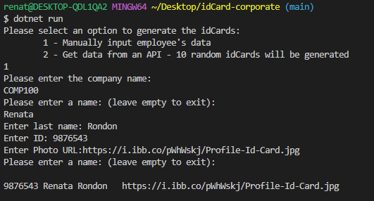
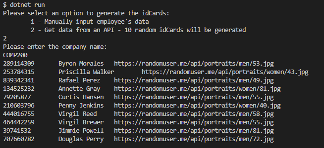

# idCard-corporate

[](https://opensource.org/licenses/MIT)

## Description

The idCard-corporate application uses C# for generating corporate ID cards. This application uses unique badge templates to produce professional-looking ID cards with the following information: company name, employee name, photo and employee's ID number.

## ID Card Preview

<p align="center">


</p>


## Table of Contents

- [Installation](#installation)
- [Usage](#usage)
- [Features](#features)
- [License](#license)
- [Contributing](#contributing)
- [Tests](#tests)
- [Questions](#questions)
- [Credits](#credits)

## Installation

This application requires the installation of .NET framework.

## Usage

Once the application starts:

```
dotnet run
```

A. the user will be prompt to select an idCard template color:

      1 - Green

      2 - Purple

B. the user will be prompt to select an option:

      1 - Manual input employee's data

      2 - Generate 10 random idCards using the API data.

- Option 1: Manual Input

  User will input employee's first and last name, employee's ID and employee's photo URL

  

- Option 2: API data

  10 random employee id cards will be generated by using an external API, to fetch random people's data.

  

## Features

The ID cards will be saved according to their unique employee ID.

## License

[](https://opensource.org/licenses/MIT)

This application is covered by MIT license, available at:
https://opensource.org/licenses/MIT

## Contributing
Please feel free to send a pull request, the following is my GitHub account: https://github.com/Renatatims

## Tests

```
dotnet run
```

## Questions

If you have any questions please contact me at:

- GitHub account:https://github.com/Renatatims
- e-mail account: renatatims@gmail.com

## Credits
https://learn.microsoft.com/en-us/nuget/consume-packages/install-use-packages-dotnet-cli
https://learn.microsoft.com/en-us/dotnet/api/skiasharp.skimage?view=skiasharp-2.88


